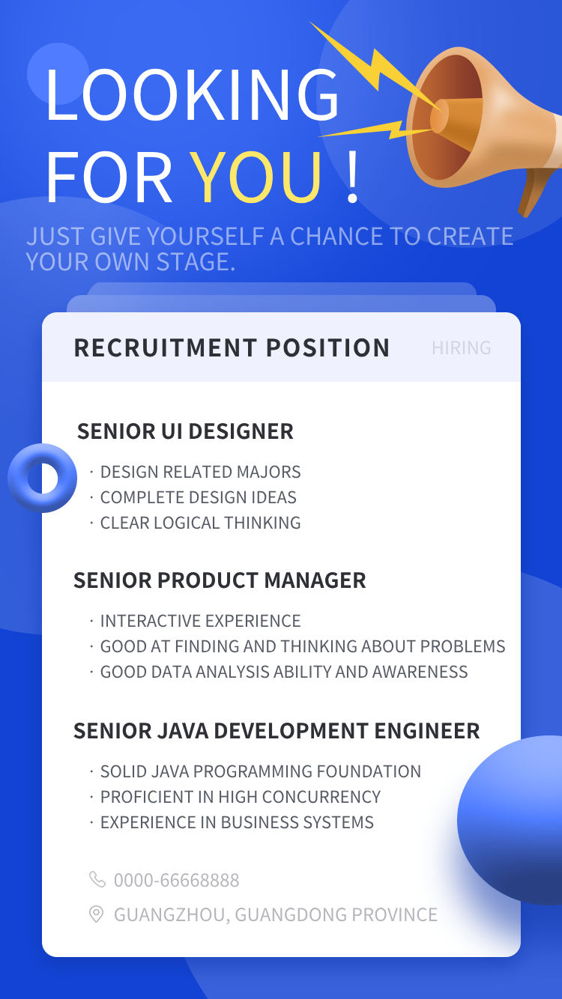

# Guangzhou Zhijia Co., LTD

 

**Here is SMARTHOME.**

 

 

 

 

## Company Introduction

**Guangzhou Zhijia Co., Ltd. is a company dedicated to the development and production of whole-house intelligent systems. We focus on providing innovative products and solutions for elderly people living alone, with a mission to care for their physical and mental health.
Our products cover many fields such as emotion recognition and health monitoring, aiming to help elderly people living alone enjoy a more convenient, safe and comfortable life. By combining the latest technology and intelligent equipment, we are committed to providing a better living environment and more comprehensive health management for the elderly.**

 

---

## Company Culture

**With the mission of caring for the elderly living alone, we drive the research and development and promotion of whole-house intelligent system products through innovative technology. Team work is our core value, we put the user experience first principle, always reliable. We encourage our employees to continue to learn and grow, while taking social responsibility and actively participating in public welfare activities. Our goal is to provide a convenient, safe and comfortable living environment for elderly people living alone, so that they can feel care and warmth. By adhering to these values, we continue to innovate and bring more well-being and value to the elderly living alone and to society.**

 

---

# We are looking for people with lofty ideals!!!

 

---

## Introduction of Board Members

 
 

### Zexin Fu, majoring in microelectronics at Sichuan University, his research interests mainly include FPGA-based deep learning gas pedal, RISC-V processor design, also interested in AI gas pedal and processor security. He won the second prize in the Southwest Region of the IC Innovation and Entrepreneurship Competition (first in the undergraduate group of the track), the third prize in the national FPGA competition, and is responsible for the project of the Science and Innovation Program of the Institute of Semiconductors, Chinese Academy of Sciences: FPGA acceleration of deep learning algorithms. Usually like to play badminton, running (recently a little lazy not how to run), playing table tennis, interested in us together to strengthen the body!

### My name is Dong Xihan, majoring in law from Beijing Jiaotong University. I am good at intellectual property law and civil and commercial law. Love Harry Potter, love to travel, love to swim and play table tennis.📍 Academic Experience:One SCI article and one work (in submission); Big Creation Project (University level) : Property service contract legislation and private law research; 📍 Internship Experience: One period of internship in case filing division of intermediate court, one period of internship in legal department of start-up company, and one period of internship in legal post of personnel department of municipal Customs; 📍 Skills: Proficient in PS and PR (mainly responsible for designing posters and video clips in the propaganda department of Student Union and drama troupe); Good at public account operation (operated class public account as class monitor, accumulated 3,000 + clicks); Good at writing (including but not limited to copywriting, meeting minutes, articles of association, etc.) I hope to cooperate with you happily!

### Hello everyone, I am Ruan Weilin, network engineering of 20 Computer Department of Jinan University. After retiring ACMer, I came to make a living. xcpc5 copper and 1 silver, Lanqiao Cup Province, one country, 2 *2, and Meisai do data analysis H Award. The project has done the provincial project of time series prediction, the selection of traditional Chinese medicine characteristics, 2 projects in medical image, and 4 independent games. Science dishes, big guy. In addition to algorithms other skill points are relatively miscellaneous, can do video can engage in project management in short, the main tool person. I also pay great attention to the friendship and cooperation of the team, hope to cooperate with the giants tacit understanding, create success!

### Hello, everyone. My name is Tao Zhibin, a senior majoring in finance from the University of International Business and Economics and the University of Portsmouth, with an average score of 94. I will introduce myself from three aspects: ability, experience and character. Professionally, I have learned related courses such as finance, accounting, management, marketing and stock investment trading, and have a certain theoretical background of business. In addition, there are currently 5 papers. Research directions include economics, blockchain technology, marketing, financial technology, etc. I once worked as an intern in an industry research position in a securities company. In terms of experience, I served as the vice president of the Student Union, and I have certain organizational and coordination abilities. In addition, he is also a member of the director team of the 2022 Beijing Winter Olympics and a member of the director team of the song and dance program of the 2022 CCTV Spring Festival Gala. Studying in the University of International Business and Economics and the University of Portsmouth, under the background of both domestic and foreign education, has cultivated my international vision and enhanced my international learning ability. Finally, in terms of personality, I am outgoing and careful. Finally, I hope we can learn from each other together. Thank you!

### Hello, uu! My name is Wei Qianjie, from the School of Design and Creativity, Tongji University. My current research direction is in the field of interaction design. The projects involved smart medical treatment (wearable device for home rehabilitation of hemiplegia), virtual reality (AR intelligent home interaction system), game design and other directions. Personal skill points include UI interactive prototyping, front-end code, 3D product modeling and rendering, PR AE video animation, and so on. The academic focus is on human-computer interaction, but at present, only one EI paper was published in ACM TEI. I really enjoy doing some projects related to design and technology and AI products. I have a lot of personal ideas, and my skills can be soft or hard. I am looking forward to conducting interdisciplinary research and creation with students from different backgrounds in the challenge camp!

### Songning Lai, Shandong University EECS experimental class. 8 national awards, two provincial awards, a total of 35 school-level awards, including scholarships, two soft articles, a patent, an EI/IEEE conference (oral and best paper award), three articles in one district and one in two districts. Above are all one work, one EI three work, is KAUST internship to do AI interpretability, leading project target AAAI and ICLR, AAAI that article is almost done, doing CBM. Personal research interests: Multimodal emotion analysis; Computer vision; DA; DG; Interpretability of AI.

 

---

 
