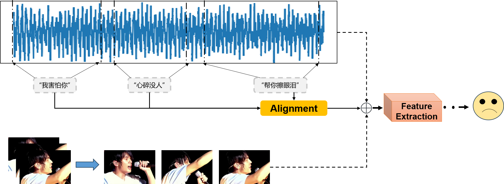
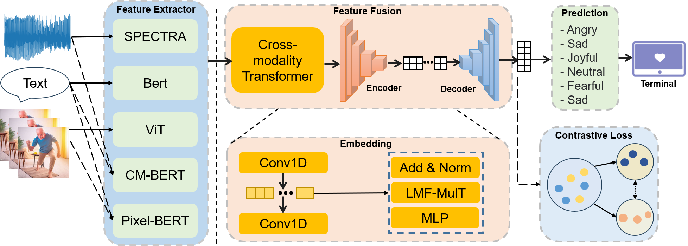
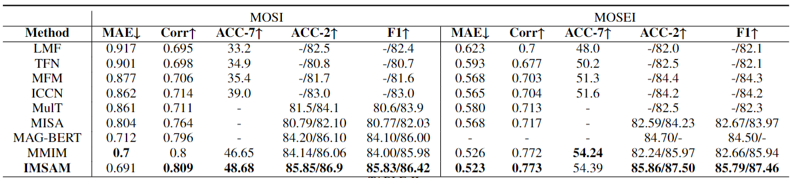
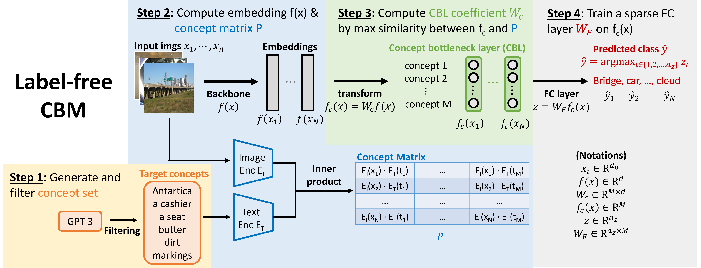
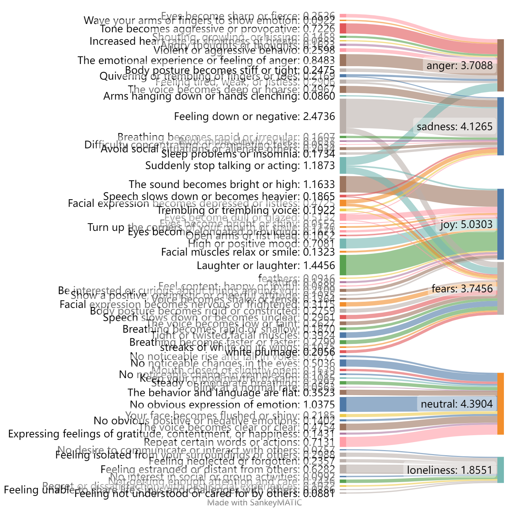
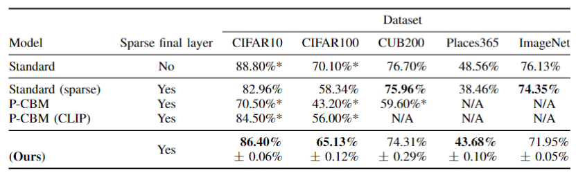
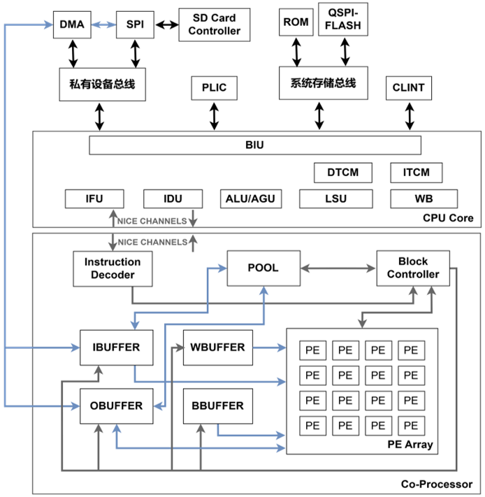
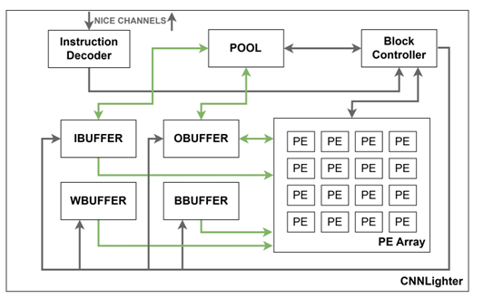
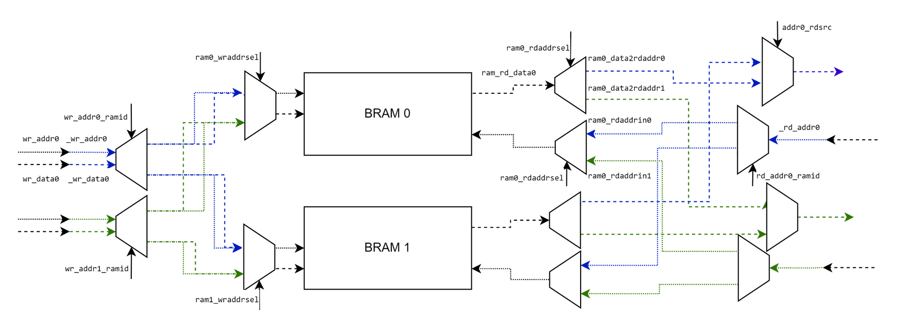
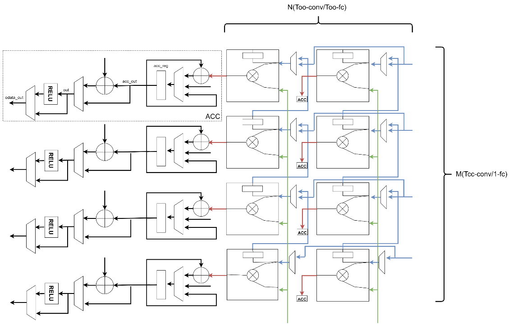

# Product Technology Poster

 

---

# Multimodal Sentiment Analysis System

 

---

# Interpretability of The System

 

---

# Hardware Acceleration

 

---
# [Technical Document](publications/images/Smarthome__中文版0709.pdf)

 

---

